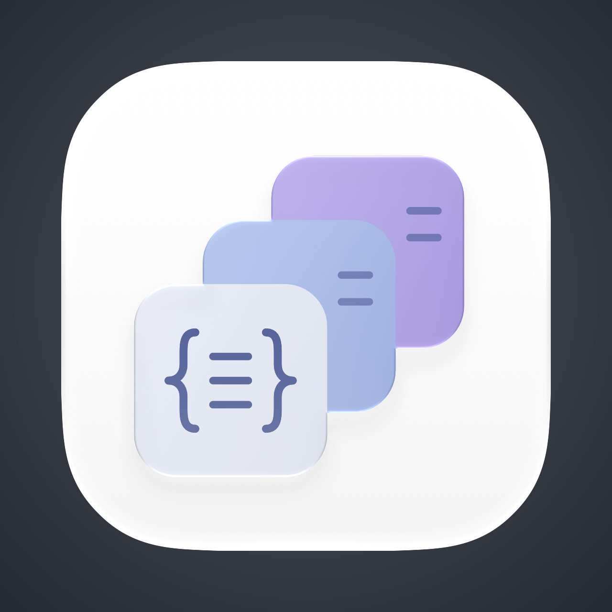

# Pre-Anything

<p align="center">
  
</p>

Native Quick Look previews for developer documents, structured data, configuration, tables, notebooks, and source code on macOS 15 and later.

- Markdown is rendered as a native readable document, including common Mermaid diagrams, LaTeX math, and syntax-highlighted fenced code.
- JSON is faithfully formatted with matching rainbow delimiters and level-aware key colors, while values use the system text color.
- YAML keeps the original source, comments, anchors, tags, and indentation while coloring keys by indentation hierarchy and leaving values neutral.
- Config Preview covers TOML, JSONC, JSON5, `.env`, INI, `.properties`, and `.conf`; source stays unchanged and values remain neutral.
- Table Preview renders CSV and TSV as native selectable, copyable tables with a fixed header row and bounded rows/columns.
- XML Preview keeps the original source, validates well-formedness, and colors tags, attributes, CDATA, comments, and entities.
- Notebook Preview safely renders Jupyter Markdown/code cells, text output, and embedded PNG/JPEG images; it never executes code or renders HTML, JavaScript, or SVG output.
- Source code keeps every character unchanged while adding native syntax colors, line numbers, selection/copy, and horizontal scrolling. The first language set covers Swift, Objective-C, C/C++, C#, Java, JavaScript/TypeScript, Kotlin, Go, Rust, Python, Ruby, Shell, SQL, and CSS.

Markdown, JSON, YAML, Config, Table, XML, Notebook, and Source Code are separate Quick Look extensions, so macOS can enable or disable each preview family independently. The containing App controls transparent backgrounds per family (or all at once) and opens the system extension management page. A macOS Team-ID App Group shares that appearance preference with the extensions; there are no background processes or network requests.

Markdown rendering remains AppKit/TextKit based: it does not use HTML, JavaScript, or `WKWebView`. Native Mermaid currently covers flowchart, sequence, state, class, ER, and XY diagrams. Unsupported diagrams and invalid math fall back to readable source text. Local and remote images remain placeholders.

Source previews use the same bounded native lexer as fenced Markdown code. They do not launch an interpreter, compiler, language server, subprocess, or network request. Languages are grouped into one Source Code switch rather than creating a system extension entry for every suffix.

## Install a GitHub development build

GitHub development builds are signed with an Apple Development certificate, but are not notarized. Download only from this repository's Releases page, drag `Pre-Anything.app` into `Applications`, then remove the download quarantine recursively so macOS can load the containing app and all eight embedded Quick Look extensions:

```sh
xattr -dr com.apple.quarantine "/Applications/Pre-Anything.app"
open "/Applications/Pre-Anything.app"
```

After the App opens once, enable the formats you want in **System Settings → General → Login Items & Extensions → Quick Look**. There is one switch each for Markdown, JSON, YAML, Config, Table, XML, Notebook, and Source Code. This is an experimental distribution path: a notarized Developer ID build is required for a normal no-command installation experience.

## Development

Requirements:

- macOS 15+
- Xcode 27 beta or a compatible later Xcode
- [XcodeGen](https://github.com/yonaskolb/XcodeGen)

Generate and open the project:

```sh
xcodegen generate
open PreAnything.xcodeproj
```

Command-line verification with the currently selected Xcode:

```sh
xcodebuild \
  -project PreAnything.xcodeproj \
  -scheme PreAnything \
  -derivedDataPath DerivedData \
  test
```

For local Finder testing, build the `PreAnything` scheme normally. Xcode can use “Sign to Run Locally”; a Personal Team can be supplied in `Config/Local.xcconfig` when needed. Copy the resulting `Pre-Anything.app` into `~/Applications` or `/Applications`, then launch it once so macOS discovers its extensions.

To create an Apple-Silicon GitHub development DMG, keep `Config/Local.xcconfig` configured with an Apple Development Team ID and run:

```sh
Scripts/package-development-dmg.sh
```

The script builds `arm64` only for Alpha releases, verifies every nested extension remains signed, and fails if a provisioning profile is embedded. It intentionally does not notarize the result. Universal packaging is deferred until the formal release stage.

Product direction and non-negotiable behavior are documented in [docs/PRODUCT_DESIGN.md](docs/PRODUCT_DESIGN.md).
