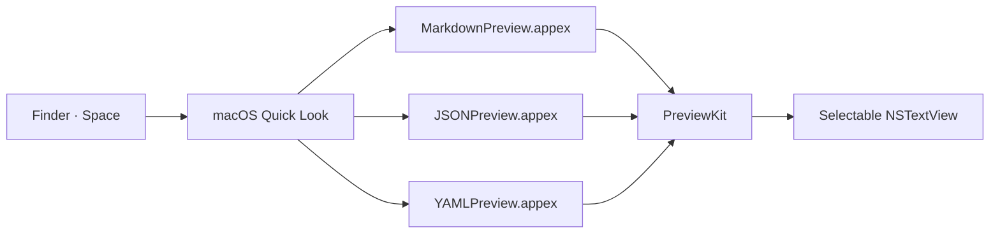
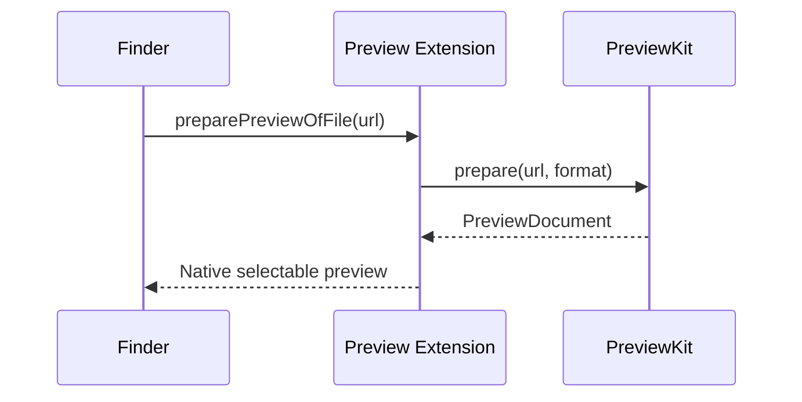

# Pre-Anything Markdown Showcase

> 一份用于检验 Quick Look 排版、语义高亮、Unicode 和降级行为的综合 Markdown 文档。
>
> **目标：** 不依赖网络、不执行脚本，并且保持文本可选择、可复制。

---

## 1. 基础排版与行内语义

这是一段包含 **粗体**、*斜体*、***粗斜体***、~~删除线~~、`inline code` 和
[安全链接](https://example.com/docs?q=quick-look) 的正文。这里还有中文标点、emoji 🧭✨、
组合字符 café / naïve，以及需要正确转义的字符：`< > & " ' / \\`。

Markdown 也可能包含脚注语法[^architecture]，即使当前渲染器暂未专门处理，也应保持内容可读。

[^architecture]: PreviewKit 负责解析，三个 Quick Look Extension 负责呈现。

### 标题层级

#### 四级标题

##### 五级标题

###### 六级标题

---

## 2. 列表、任务与嵌套结构

- 无序列表第一项
  - 第二层：包含 **强调文本**
    - 第三层：包含 `code()`
      - 第四层：深层缩进仍应清晰
- 同层第二项

1. 有序列表第一步
2. 有序列表第二步
   1. 子步骤 A
   2. 子步骤 B
3. 有序列表第三步

- [x] Markdown 标题与正文
- [x] JSON 保真格式化
- [x] YAML 原文高亮
- [x] 常用 Mermaid 图形原生渲染
- [x] LaTeX 数学公式原生排版

---

## 3. 引用与嵌套引用

> 一级引用可以有多行文字。
>
> - 引用中的列表
> - 第二项包含 `quotedCode`
>
> > 二级引用：设计应优先保证安全、稳定和可复制。
> >
> > ```swift
> > let principle = "Finder is the product interface"
> > ```

---

## 4. 表格

| 格式 | 内容策略 | 解析器 | 大文件行为 | 状态 |
|:---|:---|:---:|---:|:---:|
| Markdown | 渲染语义结构 | swift-markdown `0.8.0` | 显示源码片段 | ✅ |
| JSON | 两空格格式化并保真 token | 内部 parser | 显示源码片段 | ✅ |
| YAML | 保留原始源码 | Yams `6.2.2` | 显示源码片段 | ✅ |
| Mermaid | 六类常用图形原生渲染 | BeautifulMermaid | 不执行 | ✅ |
| LaTeX | 数学模式原生排版 | SwiftMath | 不执行 | ✅ |

包含较长单元格的表格：

| Key | Example value | Notes |
|---|---|---|
| `unicode` | `你好，世界 🌏` | CJK、emoji 与 ASCII 混排 |
| `number` | `123456789012345678901234567890` | 不应转换为浮点数 |
| `escaped` | `line1\nline2\t\\path` | 复制时应保留可见内容 |

---

## 5. 代码块

### Swift

```swift
import QuickLookUI

final class PreviewViewController: NSViewController, QLPreviewingController {
    func preparePreviewOfFile(at url: URL) async throws {
        let document = await PreviewService.prepare(url: url, as: .markdown)
        await MainActor.run {
            // Preview content is read-only and selectable.
            render(document)
        }
    }
}
```

### JSON

```json
{
  "name": "Pre-Anything",
  "formats": ["markdown", "json", "yaml"],
  "limits": { "fullMiB": 5, "previewMiB": 25 },
  "enabled": true
}
```

### YAML

```yaml
product: Pre-Anything
formats:
  - markdown
  - json
  - yaml
security:
  network: false
  sandbox: true
```

### Shell（只展示，绝不执行）

```bash
xcodegen generate
xcodebuild -project PreAnything.xcodeproj -scheme PreAnything test
```

---

## 6. Mermaid（纯原生渲染样本）





---

## 7. LaTeX（纯原生渲染样本）

行内公式：$E = mc^2$、$\sum_{i=1}^{n} i = \frac{n(n+1)}{2}$。

块级公式：

$$
\mathcal{L}(\theta)
= -\frac{1}{N}\sum_{i=1}^{N}
\left[y_i\log p_i + (1-y_i)\log(1-p_i)\right]
$$

矩阵：

$$
A = \begin{bmatrix}
1 & 2 & 3 \\
4 & 5 & 6 \\
7 & 8 & 9
\end{bmatrix}
$$

---

## 8. 图片、HTML 与安全边界

远程图片不会加载，只应留下可读的替代文字：


原始 HTML 不应执行，而应作为普通文本处理：

<details>
  <summary>这段 HTML 不应变成可交互控件</summary>
  <script>alert("must never run")</script>
</details>

---

## 9. 边界字符与超长行

反斜杠转义：\*不是斜体\*、\#不是标题、\[不是链接开头。

超长行用于检查水平排版与选择行为：`PreAnything-0123456789-ABCDEFGHIJKLMNOPQRSTUVWXYZ-abcdefghijklmnopqrstuvwxyz-你好世界-🚀-PreAnything-0123456789-ABCDEFGHIJKLMNOPQRSTUVWXYZ-abcdefghijklmnopqrstuvwxyz-你好世界-🚀-PreAnything-0123456789-ABCDEFGHIJKLMNOPQRSTUVWXYZ-abcdefghijklmnopqrstuvwxyz-你好世界-🚀`。

最后一行故意不承载特殊含义，用于确认文档结尾正常显示。
