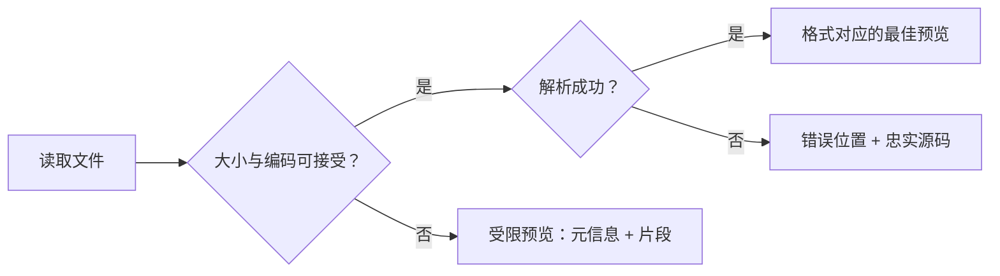

# Pre-Anything 产品设计指导

> 状态：长期维护的产品设计基线（Living Document）
> 适用范围：产品决策、交互设计、视觉设计、格式支持、技术取舍与发布验收
> 最近更新：2026-08-14

## 1. 文档目的

这份文档定义 Pre-Anything 长期不轻易改变的产品基调。

它不是首版需求列表，也不是具体实现方案。版本计划、依赖和界面细节可以随实践调整，但任何重大功能、格式扩展或架构变化，都应当能够解释它如何服务于本文定义的产品承诺。

当短期便利与本文原则冲突时，优先遵循本文；确实需要改变原则时，应先修改本文并记录理由，再修改产品。

本文使用以下词语表达约束强度：

- **必须**：不可妥协的产品要求。
- **应当**：默认遵守，只有明确理由才能偏离。
- **可以**：允许采用，但不构成产品承诺。

## 2. 产品命题

Pre-Anything 是一个面向 macOS 的开发者文件预览工具。它通过 Quick Look，让用户在 Finder 中无需打开编辑器，就能快速理解 Markdown 文档、结构化配置和常见编程语言源码。

产品的核心承诺是：

> **Readable when possible, truthful when necessary.**
> 能渲染时提供适合阅读的视图，需要确认时始终忠实呈现源码。

用户按下空格后，应当在最短时间内回答三个问题：

1. 这是什么文件？
2. 它大致包含什么？
3. 我是否需要打开专门的应用继续处理？

Pre-Anything 不替代编辑器。它减少的是“为了看一眼而启动编辑器”的成本。

## 3. 产品定位

Pre-Anything 的定位不是 IDE 或完整源码浏览器，也不是以格式数量取胜的 Quick Look 插件集合。

它专注于三类内容：

- **开发者文档**：适合转化成阅读体验，例如 Markdown。
- **结构化数据与配置**：适合提供层级、类型和语义视图，例如 JSON、YAML、TOML。
- **常见编程语言源码**：适合忠实显示原文，并通过语法颜色、行号和长行浏览降低“只为看一眼而打开 IDE”的成本。

长期差异化仍来自“理解文件”，而不是盲目增加后缀。Source Code 是一个边界明确的通用预览族，不以实现 IDE 的符号索引、跳转或执行能力为目标；格式支持达到基本完整后，产品应优先发展 OpenAPI、Kubernetes、Docker Compose、项目清单等语义预览。

## 4. 目标用户与使用场景

### 4.1 核心用户

- 经常在 Finder 中浏览项目、下载目录和构建产物的开发者。
- 需要快速检查配置文件，但不希望打断当前工作流的人。
- 阅读 AI、自动化工具或同事生成的 Markdown、JSON、YAML 和源码文件的人。
- 在代码审查、演示或屏幕共享前，需要快速确认文件内容的人。

### 4.2 核心任务

- 判断一个 README、设计文档或报告是否值得打开细读。
- 查看压缩或深层 JSON 的结构与关键值。
- 检查 YAML 的缩进、注释、锚点和多文档结构。
- 定位无效 JSON/YAML 的错误行列。
- 在不启动 IDE 的情况下快速检查 Python、Java 等常见源码的结构和实现。
- 快速理解配置文件代表的服务、依赖、接口或资源。

### 4.3 非核心场景

- 长时间阅读和管理文档库。
- 编辑、保存、格式化或批量转换文件。
- 替代 IDE、终端工具或数据库客户端。
- 执行文件中包含的代码、脚本或网络请求。

## 5. 产品原则

### 5.1 即时优先

Quick Look 是一个短暂、低意图的交互。用户没有耐心等待启动页、加载动画或后台服务。

- 预览必须尽快出现。
- 不得为了次要视觉效果牺牲启动速度。
- 不应依赖常驻进程、云服务或网络资源。
- 遇到大文件时应主动降级，而不是让整个预览卡死。

### 5.2 每种格式只有一个最佳预览

Quick Look 不是编辑器，也不需要在多种视图间切换。每种格式必须提供一个固定、可预测的最佳预览：

- Markdown 直接渲染为阅读视图。
- JSON 在解析成功后按两个空格格式化并高亮，但必须保留键顺序、重复键和数字原始写法。
- YAML 保留原始源码、换行、缩进和注释，只增加高亮。
- Source Code 保留原始字符和换行，只增加有界的词法高亮、行号和长行横向滚动。
- 解析失败不得隐藏原始内容；产品不得静默排序、转换数值或遗漏数据。

### 5.3 格式感知，而非统一套壳

不同格式有不同的最佳阅读方式：

- Markdown 默认面向阅读。
- JSON 默认面向格式化源码。
- YAML 默认面向源码，因为注释与书写形式具有意义。
- Source Code 默认面向忠实源码，不格式化、不折行、不执行。
- JSONL 默认面向记录流，而不是一次性构造完整树。
- CSV/TSV 默认面向表格，而不是代码高亮。

所有格式共享视觉语言，但不强求共享完全相同的布局。

### 5.4 优雅降级

失败不是空白窗口，也不是笼统的“无法预览”。

任何支持的文本格式都应遵循以下退路：



- 解析失败时仍应显示源码。
- 文件过大时应显示原因和已采用的限制。
- 未知编码不得导致扩展崩溃。
- 某项增强能力失败时，基本预览仍应可用。

### 5.5 本地、私密、可预测

- 文件内容必须在本机处理。
- 默认不得上传文件、片段、文件名或路径。
- 默认不得加载远程图片、脚本、字体或样式。
- 不得执行 Markdown、配置文件、代码块或源码文件中的内容。
- 不应申请与核心功能无关的文件系统权限。
- 产品不得加入默认开启的遥测。

### 5.6 安静的原生感

Quick Look 属于系统工作流，产品不应抢夺注意力。

- 预览中不显示广告、捐赠提示、版本宣传或产品 Logo。
- 不使用与内容无关的动画、渐变和装饰。
- 控件数量保持最低，只提供当前预览真正需要的动作。
- 界面应像 macOS 能够原生提供、只是尚未提供的能力。

### 5.7 深度优先于广度

新增格式必须带来明显优于系统纯文本预览的体验。仅仅增加一种新的语法颜色，不足以成为独立格式或独立扩展；常见编程语言应复用统一的 Source Code 预览模型。

每一种受支持格式都必须具备：

- 明确且唯一的预览形式。
- 忠实源码或等价退路。
- 解析错误处理。
- 大文件策略。
- 测试样本和性能基线。
- 可维护的 UTI 注册方式。

## 6. 核心交互模型

### 6.1 首次使用

Containing App 只承担扩展安装、外观偏好与管理入口职责：

1. 说明 Pre-Anything 的用途。
2. 列出 Markdown、JSON、YAML、Source Code 四个独立扩展。
3. 引导用户进入 macOS 系统设置启用或停用各格式扩展。
4. 分别设置 Markdown、JSON、YAML、Source Code 是否使用透明背景，并可一次应用到全部格式。

用户不需要保持 App 或菜单栏进程运行。透明背景是唯一的预览偏好，由 App Group 持久化并供扩展按启动时读取。

### 6.2 日常使用

```text
Finder 选中文件 → 按空格 → 理解内容 → 关闭或打开专门应用
```

预览页面应由两个区域组成：

1. **主内容区**：该格式固定的最佳预览。
2. **非阻塞提示区**：仅在错误、降级或安全限制发生时显示。

不得重复 Finder 已经清楚显示的信息，也不得挤占主要阅读空间。

### 6.3 固定预览

产品不提供视图选择器或预览内控件。Containing App 中唯一允许的格式偏好是透明背景：

| 格式 | 唯一预览 |
| --- | --- |
| Markdown | 原生渲染阅读视图 |
| JSON | 两空格格式化源码与高亮；失败时原文与错误位置 |
| YAML | 未修改的原始源码与高亮 |
| Source Code | 未修改的原始源码、原生词法高亮、行号与横向滚动 |
| JSONL / NDJSON | 有界的记录流 |
| TOML | 格式感知的源码高亮 |
| CSV / TSV | 表格 |

格式开关必须通过独立 Quick Look 扩展和 macOS 系统扩展管理实现。不得用 App 内偏好让仍然注册 UTI 的扩展“假装关闭”。

## 7. 格式体验规范

### 7.1 Markdown

Markdown 的目标是“按下空格，直接像文档一样阅读”。

首要支持：

- 标题、段落、强调、链接和引用。
- 有序与无序列表。
- 任务列表。
- GitHub Flavored Markdown 表格。
- 行内代码与支持常见语言原生高亮的围栏代码块。
- 分隔线和删除线。
- 行内与块级 LaTeX 数学公式。
- 原生 Mermaid：Flowchart、Sequence、State、Class、ER 和 XY Chart。
- YAML Front Matter。
- GitHub 风格 Alerts，例如 Note、Tip、Warning。

设计要求：

- 阅读内容应限制最大行宽，避免超宽段落。
- 代码块和宽表格可以横向滚动，不应撑坏正文布局。
- 标题层级必须清晰，但不夸张。
- 未识别语言的代码块仍应以等宽文本正确显示。
- 不支持或无效的 Mermaid、数学公式必须回退为可读源码，不得让整篇预览失败。
- 原始 HTML 默认不渲染。
- 远程图片默认不加载。
- 相对图片无法在沙盒中读取时，应显示明确占位，不应申请整个磁盘访问权限。

更多 Mermaid 图表类型、脚注、Wiki Link、MDX 和 Quarto 属于增强能力，不得阻塞基础 Markdown 体验发布。

### 7.2 JSON

JSON 的目标是“用可读的格式化结果快速理解结构，同时保持数值与顺序可信”。

- 解析成功后固定使用两个空格缩进。
- 使用结构化彩虹配色：每一层拥有固定颜色，成对 `{}` / `[]` 必须同色，键使用所在层颜色；值使用系统正文色，避免大段数据产生视觉噪声。
- 必须保留原始键顺序和重复键。
- 必须保留数字的原始文本表示，避免大整数和高精度小数经过浮点转换后失真。
- 不提供折叠树、路径导航或格式化/原文切换。

无效 JSON 必须显示尽可能准确的行、列和原因，并突出相关源码位置。

### 7.3 YAML

YAML 的目标是“尊重作者写下的形式，只增加帮助阅读的颜色”。

- 预览必须保留原始换行、缩进和注释。
- 按实际缩进栈为键、序列标记和结构标点分配层级颜色；值使用系统正文色，缩进回退时键必须回到对应层的颜色。
- 必须识别并展示多文档分隔符。
- 锚点、别名、自定义标签和特殊标量应有视觉区分。
- 解析器不支持的自定义标签不得导致源码不可见。
- 不得重新序列化 YAML，也不提供结构树。

### 7.4 Source Code

Source Code 的目标是“按下空格即可可靠看懂一段实现，不必为只读检查启动 IDE”。

- 必须逐字符保留原文，不自动格式化、补全、折叠或改写换行。
- 使用等宽字体、行号和横向滚动；行号不属于正文，选择复制时不得混入。
- 首批覆盖 Swift、Objective-C、C/C++、C#、Java、JavaScript/TypeScript、Kotlin、Go、Rust、Python、Ruby、Shell、SQL 和 CSS。
- 所有语言统一属于一个 Source Code 扩展和系统开关，不为每种后缀制造独立扩展。
- 高亮器必须有输入上限并允许降级为普通等宽文本；未知语言不得导致空白预览。
- 不提供符号索引、跳转定义、代码执行、编译、诊断、语言服务器、Git 状态或编辑能力。
- 不启动解释器、编译器、子进程或网络请求。

是否新增语言应依据常见程度、UTI 可路由性和词法维护成本，而不是追求后缀数量。

### 7.5 后续结构化格式

- JSONL / NDJSON 应按记录流式处理并限制展示数量。
- TOML 应正确处理日期、特殊浮点值、数组表和点分键。
- CSV / TSV 应正确处理引号、换行字段、编码和不规则行。
- Property List 应同时处理 XML 与二进制形式，但不得与系统已有优秀预览无意义竞争。

## 8. 语义预览

语义预览是长期产品价值的核心，而不是首版发布前提。

语义预览在通用格式视图之上增加一个只读摘要，不改变或隐藏原始内容。例如：

- `package.json`：包名、版本、脚本、依赖数量、运行时要求。
- `pyproject.toml`：项目元数据、构建系统和依赖组。
- Docker Compose：服务、镜像、端口、网络和卷。
- Kubernetes：Kind、Namespace、容器、镜像和资源声明。
- OpenAPI：版本、路径数量、操作、Schema 和认证方式。
- GitHub Actions：触发事件、Jobs、权限和依赖关系。
- JSON Schema：定义、必填字段、引用和约束。

语义预览必须遵循：

- 只从本地文件确定性生成。
- 摘要中的每个结论都能在源码中找到依据。
- 识别失败时无缝回退到通用格式视图。
- 不因文件名相似就强行套用错误模板。
- 不使用生成式 AI 推测文件含义。

## 9. 视觉与内容设计

### 9.1 视觉基调

- 使用系统字体呈现正文，使用合适的等宽字体呈现源码。
- 默认跟随系统浅色与深色模式。
- 使用可辨认且适配深浅外观的系统颜色；JSON/YAML 的彩虹色只编码真实结构层级，不作无语义装饰。
- Markdown 使用适合阅读的正文样式；结构化数据使用等宽字体和更充分的横向空间。
- Markdown、JSON、YAML 和 Source Code 的主画布都不主动绘制底色，透出 Quick Look 宿主背景；代码块、行内代码、表格和诊断信息仍可保留自身的内容背景。
- 分隔线、缩进线和背景层级应辅助理解，不应成为视觉主体。
- 动画只用于解释状态变化，并尊重“减少动态效果”系统设置。

### 9.2 文案基调

界面文案使用简短、准确、非责备性的英文，为国际化保留空间。

推荐：

```text
Invalid JSON · Line 18, Column 27
Expected a comma before "version".
```

避免：

```text
Failed!
The file is broken.
Something went wrong.
```

错误提示应说明发生了什么、位置在哪里，以及产品采用了什么退路。

### 9.3 可访问性

- 信息不得只依赖颜色表达。
- 文本应支持系统缩放与足够对比度。
- 错误提示必须具有可理解的辅助功能标签。
- 键盘焦点顺序应稳定且简短。
- 长内容不得因动态字体造成不可恢复的布局破坏。

## 10. Containing App 的边界

App 的存在是现代 macOS 打包和分发 Quick Look 扩展的要求。它不是产品的主要使用界面。

它只包含：

- Markdown、JSON、YAML、Source Code 扩展及其用途说明。
- 四类预览独立透明背景开关与全选操作。
- 打开 macOS 扩展管理入口的操作。
- 必要的版本与开源许可信息。

它不得包含：

- 透明背景以外的预览偏好或格式内开关。
- App Group 中与透明背景无关的共享状态。
- 示例文件浏览器和内嵌预览器。
- 完整编辑器。
- 文档库、标签或同步系统。
- 不必要的菜单栏常驻进程。
- 与 Quick Look 无关的开发者工具集合。
- 为提高打开频率而设计的通知或促销入口。

## 11. 隐私与安全

安全不是一项可配置功能，而是所有渲染器不可关闭的默认行为。

### 11.1 内容安全

- Markdown 原始 HTML 默认禁用。
- 链接协议必须使用允许列表。
- 不引入 HTML/WKWebView 渲染层，不执行 JavaScript。
- 不加载 CDN、远程图片或远程字体。
- 不运行外部命令、解释器、语言服务器或文件中的脚本。
- 解析器必须配置深度、节点数、字符串长度和输出大小限制。

### 11.2 数据安全

- 默认不收集使用分析。
- 崩溃或诊断报告不得包含文件正文、文件名或完整路径，除非用户明确选择附带。
- 敏感值遮罩只能作为明确开启的 Presentation Mode，不能默认改变用户看到的内容。
- 任何未来网络能力都必须是独立、明确、默认关闭的选择，并且不得成为基础预览依赖。

## 12. 性能与可靠性基线

性能指标应通过固定测试样本持续验证，而不是依赖主观感受。

初始质量目标：

- 常见小文件应当接近即时显示。
- 典型 1 MB 文件的扩展内处理时间目标为 300 ms 以内。
- 渲染时间和内存占用必须随输入大小受到明确限制。
- 同一个异常文件重复预览不得造成持续崩溃循环。
- 扩展不得长期持有文件描述符。
- 解析和渲染失败必须返回可显示的退路。

初始大文件策略：

| 文件大小 | 默认策略 |
| --- | --- |
| 0–5 MB | 完整读取、解析和渲染 |
| 5–25 MB | 显示最多 1 MiB 的高亮源码片段，不做完整解析 |
| 25 MB 以上 | 元信息、文件片段和明确的受限预览提示 |

这些阈值可以依据基准测试调整，但“有界处理、主动降级”的原则不可取消。

## 13. 格式准入标准

新增格式前必须回答：

1. 目标用户是否经常在 Finder 中遇到它？
2. 我们能否提供明显优于系统预览的体验？
3. 它是否有可靠、可维护的 UTI 路由方式？
4. 是否存在许可合适、可沙盒运行的解析方案？
5. 解析失败和大文件时如何退路？
6. 是否会与系统或常用第三方扩展产生严重冲突？
7. 它能否复用现有结构模型或渲染器？
8. 团队是否愿意长期维护它的测试样本和安全边界？

仅满足“可以加语法高亮”不构成准入理由。

## 14. 技术架构对产品的约束

技术实现可以演进，但必须保护以下产品属性：

- 使用现代 Quick Look Preview Extension，不使用旧式 `.qlgenerator`。
- Markdown、JSON、YAML、Source Code 分别使用独立扩展，使用户可以在 macOS 中真实启停单个预览族，并允许其他扩展接管；Source Code 内的语言共享一个扩展。
- 共享的 PreviewKit 负责读取、识别、解析、限制与渲染模型，并静态链接进各扩展。
- Containing App 使用 SwiftUI；扩展使用原生 AppKit 视图型预览。
- 不引入 HTML、WKWebView 或 Web 渲染管线。
- 不依赖 Electron、Node 或外部运行时。
- 不为基础功能引入 XPC 服务或非沙盒辅助进程。
- 仅使用签名 Team 派生的 `<TeamID>.com.lixinlv.PreAnything` macOS App Group 同步四类预览的透明背景偏好，不承载文件内容或其他共享状态；不得使用需要 provisioning profile 的 `group.` 前缀。
- UTI 必须显式、精确注册，不得笼统抢占 `public.text` 或 `public.data`。
- 第三方依赖必须固定版本、检查许可，并可在扩展沙盒内确定性运行。

## 15. 版本演进方向

### 阶段一：建立信任

- Markdown、JSON、YAML、Source Code。
- Markdown 原生阅读、JSON 格式化高亮、YAML 原文高亮、常见源码原文高亮与行号。
- 深浅色、错误提示、编码处理和大文件降级。
- 四个预览扩展可在 macOS 中独立启停。

### 阶段二：扩展日常数据格式

- JSONL / NDJSON。
- TOML。
- CSV / TSV。
- JSONC 和常见 Apple 配置格式。

### 阶段三：理解文件语义

- 项目清单。
- 容器与部署配置。
- API 与 Schema。
- CI/CD 工作流。

### 阶段四：谨慎增强表达能力

- 扩大原生 Mermaid 图表类型覆盖。
- 使用正式 grammar 扩大代码语言覆盖。
- Finder 缩略图。

这些能力只有在不破坏启动速度、安全边界和基础预览稳定性时才应加入。

## 16. 明确的非目标

除非产品定位被正式重新讨论，否则 Pre-Anything 不追求：

- 成为完整 Markdown 编辑器。
- 成为通用 IDE 或具备索引、导航、编辑能力的完整源码浏览器。
- 以支持格式数量作为主要营销指标。
- 运行文件中的代码或调用外部编译器。
- 使用云端 AI 总结本地文件。
- 通过默认联网换取渲染能力。
- 在 Quick Look 中复制完整桌面应用的所有功能。

## 17. 发布验收标准

一个版本只有在满足以下条件时才应被视为可发布：

- 支持格式的合法、非法、空白、极深、超长行和大文件样本均有测试。
- 浅色、深色和高对比度环境均可读。
- 用户始终能够确认预览是否经过格式化或降级。
- 任意单个文件无法导致 Finder 或 Quick Look 持续不可用。
- 扩展离线工作，不依赖宿主 App 常驻。
- 新依赖已完成许可、安全和体积审查。
- 已在目标最低 macOS 版本和当前 macOS 版本验证。
- 已验证与至少一个常见同类 Quick Look 扩展共存时的行为。

## 18. 产品决策检查表

提出新功能时，应先回答：

- 它是否让用户更快理解文件？
- 它是否损害内容真实性？
- 它是否增加启动时间、权限或网络依赖？
- 它是否应该出现在短暂的 Quick Look，而不是完整 App？
- 当它失败时，基础预览是否仍然可用？
- 它是否适用于一种格式，还是可以形成可复用能力？
- 它是否值得未来数年的维护成本？

如果这些问题没有清楚答案，默认不加入。

## 19. 产品宣言

Pre-Anything 应当始终是一款安静的工具。

它不要求用户改变文件，不要求用户进入新的工作流，也不要求用户相信一个不可核对的渲染结果。它只在用户按下空格的那一刻出现，把原本难读、压缩或陌生的内容变得清晰；完成任务后立即退场。

我们不以“什么都能打开”为目标，而以“打开的每一种文件都值得信任”为标准。
